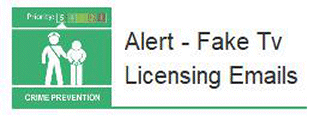

8 January 2019

Alert - Fake TV Licensing Emails

Thanks to Neighbourhood Alert for sending the following warning from Action Fraud Alert :

Click on the image to

read the full alert.

Action Fraud has received more than 5,000 reports about fake emails and texts purporting to be from TV Licensing. The messages contain links to genuine-looking websites that are designed to steal personal and financial information.

For more information about how to stay safe online, visit [www.cyberaware.gov.uk](https://www.cyberaware.gov.uk)
