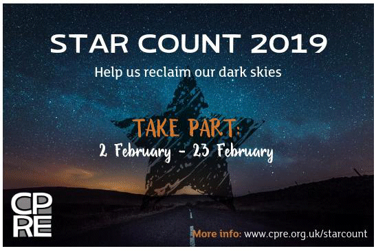

14 January 2019

CPRE Star Count 2019

The Council for the Preservation of Rural England are holding a 'Star Count' between 2 February and 23 February in order to get a better and more update picture of how light pollution is affecting our ability to enjoy the night sky.

Click on the poster to visit the CPRE Web Site and get more details.
