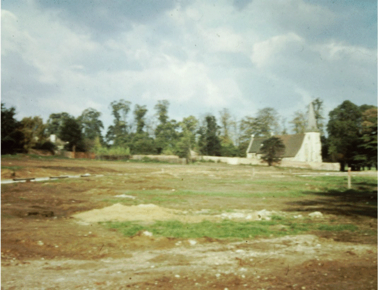
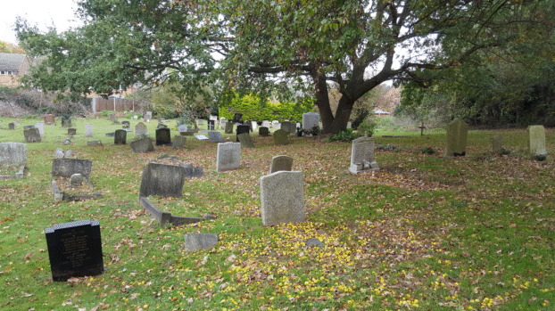

22 January 2019

HISTORY OF OUR ASSOCIATION Part 13 1957

Thanks to Jean Gammons for this chapter in her fascinating series of articles documenting the early years of the NCRA.

On 25 March six European countries created the Common Market. In May, emergency petrol rationing ended and Britain dropped its first hydrogen bomb on Christmas Island in the Pacific. On 1 June ERNIE (Electronic Random Number Indicator) picked the first premium bond winners; later in the month a special Medical Research Council report declared that "A relationship between lung cancer and smoking exists". In July Stirling Moss became the first Briton to win the British Grand Prix since 1923; and prime minister Harold Macmillan declared "Most of our people have never had it so good". By 11 August Myxomatosis had spread from Kent to 11 English counties; and in Kent foot-and-mouth disease had created the need to slaughter 1,000 animals. By September an outbreak of influenza sweeping Britain was diagnosed as "Asian Flu", children being particularly affected. In October a petition signed by 1,000 parish councils was presented to the government requesting that branch railway lines should not be closed; and Russia launched a satellite into space - Sputnik-1. The year ended with a major train crash at Lewisham, two trains colliding in the fog had resulted in the death of 92 passengers - Bob Ogley.

At its meetings in January and February, the Committee continued to discuss the proposals for the North Cray Place Estate. Of the 132 dwellings, there were to be 98 3-bedroom houses, 26 2-bedroom houses and eight bungalows for old people - plus 27 lock-up garages. It noted that the UDC had agreed to sell to the C.S. Housing Association Ltd land on the northern and western sides of The Spinney, enabling it to build eight houses - reducing the number of Council houses to 124. It also expressed its concern about the possibility of £10,000 being spent by the Council on a Community Centre at Beden's Field.

In February the Committee noted that there was to be an Appeal against the Council's refusal of planning permission for The Gattons to be used as a Coach Station.

In March there was mention of the Newsletter being ready for distribution, the first mention of this now-annual NCRA publication.

At its two meetings in April, the Committee expressed concern about people with guns walking up and down The Grove and The Spinney, and living on Council land. It also noted that the plans for the new Council estate on North Cray Place land had now been put before the Minister, who was to hold an Public Inquiry. It agreed to raise money to try to stop the development - £3.3.0d apiece, with 24 sponsors ready to retain the services of a counsel.

In June, to sit-in at the Public Inquiry into the Council's scheme to erect 132 houses on the North Cray Place Estate, local residents crowded into the Council Chamber at Sidcup Place. There, they heard that the Council had decided to build only 124 houses themselves, allowing a self-build housing association to build eight near The Spinney; and that the vast majority of trees would be preserved, including "two fine Cedar trees".

At its meetings in July, the Committee expressed renewed concern about the use of firearms in the Meadows and the traffic danger in the North Cray Road. Here, there had been a fatal accident on 7 June, when a lorry mounted the pavement and killed two children - nine-year old Margaret Harmer and four-year old Norman Buller. But the chairman of the UDC's Highway Committee had said that a widening of the North Cray Road "was not likely for many years". The children were buried in St James graveyard, Parsonage Lane. Other matters discussed were the the refusal of planning permission for The Gattons to be used as a petrol filling station, and the granting of planning permission for a temporary bungalow in Cocksure Lane for use by the Forestry Commission. Again, the Committee heard about motor cycles driving at speed down The Grove and into Foots Cray Meadow. For one of these meetings, North Cray's councillor, Mr G H Kirby Smith, had been invited, who stated that Foots Cray Meadow was a Public Open Space owned by the Council. It was hoped to eventually provide a number of riverside Walks, but funding was restricted on projects of this type.

The Committee also noted that the Minister had granted the building application for residential development on the 13.4 acres of land at the North Cray Place Estate.

To be continued
