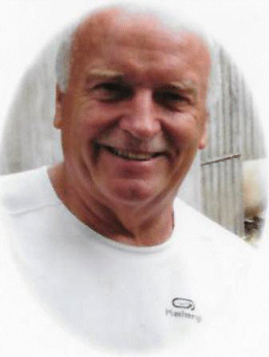

23 January 2019

MICK DOUGHTY

It is with great sadness that we tell members that Mick died suddenly on Boxing Day after a short illness that had caused him to retire from our Committee last November.

He had served on our Committee since 2014, his election following the sterling work he had done in team-leading local residents' efforts against a large Polytunnel development on Green Belt land at Honey Dale Farm. This fight was lost as the odds were against us winning; but no one could have worked harder than Mick in our efforts to overcome Planning's support of this development. As a Committee member, Mick assumed special responsibility for matters affecting North Cray's precious Green Belt, reading and analysing changing legislation. Together with our Secretary, Jean Gammons, and more recently with our new Treasurer, Chris Moon, Mick attended most of the meetings of the London Green Belt Council. And in early November last year, shortly before he became seriously ill, he helped with our letter of Objection to the proposal for 67 houses to be built on Green Belt land at No. 139 North Cray Road (please see our NewsMail of 13 November). This was a fight we won, largely with Mick's help.

On 22 January our President, John Harrington, together with Jean and Chris, attended Mick's burial service at Eltham Cemetary as representatives of the NCRA. This was attended by around 100 people, family and friends, and moving Eulogies were given by Mick's son and brother.

Mick truly was a family man: a loving husband, father and grandfather. And he always had time to spare for the needs of others. We in North Cray will always remember him for what he did to protect our Green Belt.

The Association has made a donation of £100 to Pancreatic Research in Mick's memory, and it sent a small floral tribute to the cemetery. [The Order of Service](http://www.northcrayresidents.org.uk/image/pdfs/m_doughty.pdf)
