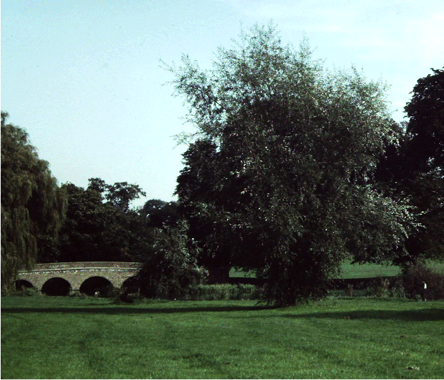
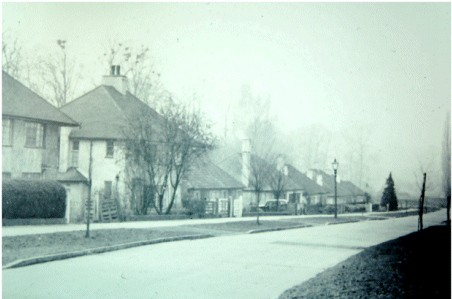

23 January 2019

HISTORY OF OUR ASSOCIATION Part 13 1957 Continued

The AGM was held on 25 September at the North Cray Place Club. The number of members was now about 160, and the Balance of accounts stood at £2.5.1d.

Two guest speakers had been invited to address the meeting: J Campbell Carter JP, Chairman of the UDC; and Mr G H Kirby Smith, North Cray's Ward councillor.

Mr Campbell Carter "congratulated the Association on their work - pointing out that there were now seven Ratepayers or Residents associations in the district, forming a strong movement". Turning to the subject of Footscray Meadows, he said that he "hoped the Association would not press for formal gardens and recreation grounds, but would try and preserve the rural nature of this Open Space".

Cllr G H Kirby Smith reported that progress was being made to bring the new main sewer to North Cray. He hoped that houses still on cesspools would be on mains drainage by 1959/60. The sewer would probably go down the centre of Honeyden Road.

At its meeting in October, the Committee noted the report by the Secretary (Colin Wollweber) that:-

- the repairs to the surface of Five Arch Bridge would be dealt with.

- cattle grazing on the Meadows was to continue.

- roadside trees on the Estate had disappeared.

- about 21 trees at High Beeches under a KCC Preservation Order had been marked for demolition. Here, it was agreed that efforts should be made to prevent the demolition of trees that were not diseased or dangerous, and that re-planting should be carried out.

At its meeting in November, the Committee was told that a certain number of the trees at the rear of High Beeches would be felled and would not be replaced.

At its last meeting of the year, in December, the Committee again expressed its concern about the Warden's Post at High Beeches; but the Secretary reported that he had been informed by the UDC that this building was still vital for the Civil Defence of North Cray, and must be retained.
