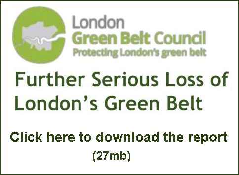

28 January 2019

London Green Belt Council report

Thanks to Hilary Livesey, Administrator, London Green Belt Council for sending the following report :

Please see the London Green Belt Council's latest report on threats to London's Green Belt from proposed development.

This is the third in a series of annual reports documenting the continuing threats to the Green Belt, which unfortunately are increasing.

Members will be pleased to see the entry for Bexley (on page 17).
