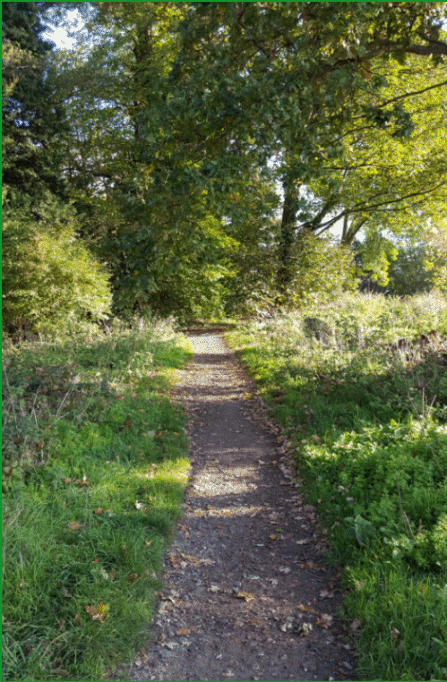
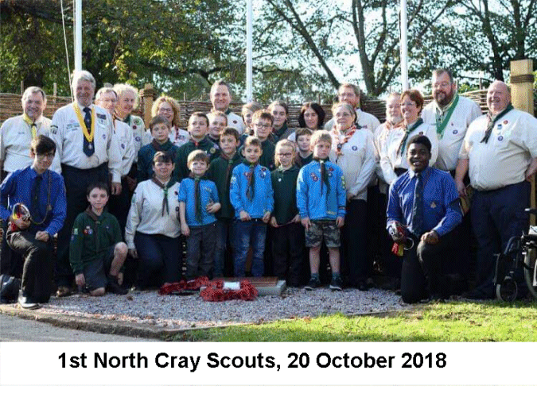

12 February 2019

HISTORY OF OUR ASSOCIATION Part 14 1958

In February America put a satellite into space developed by a team led by Werner von Braun, the German scientist who masterminded the V2 rocket; and the "Campaign for Nuclear Disarmament" was formed (in April more than 3,000 marched to Aldermaston for a CND rally at the gate of the Atomic Weapons Research Establishment). In March the Bishop of Woolwich said that mothers who work are enemies of family life. In July Prince Charles was created Prince of Wales. The following month saw a new stereophonic recording at that year's Radio Show - new words among record enthusiasts included "stereo" and "hi-fi" (high fidelity). September saw NW Kent hit by a two-hour thunderstorm called the 'storm of the century' . In October a new airliner, the Boeing 707, flew across the Atlantic just 22 days after the British Comet started its transatlantic service - Bob Ogley.

At its meeting in March the Committee was informed that the sub-committee had inspected the plans of the North Cray Place Estate - all the houses would be semi-detached and the 12 houses adjoining the existing houses in The Grove would be hip-roofed.

In July the Committee discussed the frequent flooding which occurred in the North Cray Road [now Leafield Lane] by the former Rectory and noted that the Council had passed the plans for the North Cray Church Hall.

At its September meeting, the Committee discussed the recent flooding throughout the District; and agreed that improved access to the Meadows from Riverside Road, and to Mount Misery and Chalk Wood from Parsonage Lane, should be sought, even if only by laying down hardcore and cinders.

The AGM was held on 25 September at the North Cray Place Club. The Chairman reported that the Executive Committee had held 12 meetings in addition to various sub-committee meetings. 154 households were now represented and the balance of accounts stood at £40.0.6d.

Two invited Speakers addressed the meeting: Mr Speller, Probation Officer for the Cray District; and Cllr Mr Macdonald.

Mr Speller said that the "Present growth in vandalism was a product of the post-war years and the breaking up of home life. The two World Wars had reduced the moral standards of the country and had often taken the mother from the home during the daytime. Defective homes had also contributed to the formation of young delinquents...offenders were rarely found in the scouting and guiding movements". Discussion followed, when the meeting agreed that more parental control was important...and in many cases bad standards were set by the parents".

Councillor Macdonald reported that plans were being drawn up for Footscray Meadows and it was hoped that agreement would be reached with Goldsmiths' College [Loring Hall] over the dedication of the portion of their land along the river bank. "Personally, he felt that it would not be in the interests of local people either for Sidcup and Chislehurst to become part of an enlarged Greater London or a separate unit comprised of the Boroughs and Urban Districts in NW Kent". In the following discussion several members said that they would prefer Sidcup to remain in the county of Kent.

The year closed with the Committee noting that a complaint had been received about television interference and noise coming from the garage of Gattons, where work was being done on sports cars.
