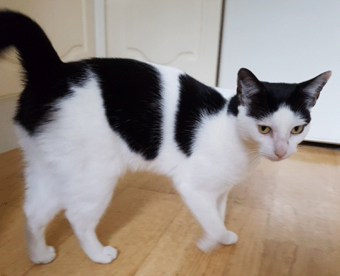

17 February 2019

Missing Cat - can you help?

We have received the following appeal from Will Robertson for help in finding his lost cat :

RegardsWill Robertson54 The Spinney

Regards

Will Robertson

54 The Spinney

She is a timid, small black and white cat, who is two years old. She is micro-chipped.

If people could check garden sheds and garages etc, this could be helpful.

I attach a picture.

Hi,

I hope you can help. My cat Nellie has been missing for 48 hours, the first time she has disappeared in the year since we adopted her from a rescue centre.

