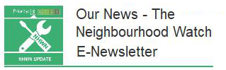

20 February 2019

(2) Peoples Question Time at Crook Log Leisure CentrePeople's Question Time in Bexley will take place Thursday 14th March 19:00 - 21:00 at Crook Log Leisure Centre.This is an opportunity to both make your own voice heard, and to hear from the Mayor and London Assembly about their vision for London.Follow this [LINK](https://www.london.gov.uk/events/2019-03-14/peoples-question-time-bexley)for more information.(3) Doorstep TraderThere is a very polite young man with a white van visiting properties and touting for business in and around North Cray.The services that he offers include cleaning gutters and steam cleaning pathways and roofs.He may be quite genuine, but NCRA has heard of one elderly resident paying a large amount of money to have their roof steam cleaned, something that was probably quite unnecessary.The young man only accepted cash payment, did not give any guarantee and was probably uninsured.We can only repeat the usual advice - get several estimates for any work you want done. Only employ reputable workers, Never give work to cold callers.

(2) Peoples Question Time at Crook Log Leisure Centre

People's Question Time in Bexley will take place Thursday 14th March 19:00 - 21:00 at Crook Log Leisure Centre.

This is an opportunity to both make your own voice heard, and to hear from the Mayor and London Assembly about their vision for London.

Follow this [LINK](https://www.london.gov.uk/events/2019-03-14/peoples-question-time-bexley) for more information.

(3) Doorstep Trader

There is a very polite young man with a white van visiting properties and touting for business in and around North Cray.

The services that he offers include cleaning gutters and steam cleaning pathways and roofs.

He may be quite genuine, but NCRA has heard of one elderly resident paying a large amount of money to have their roof steam cleaned, something that was probably quite unnecessary.

The young man only accepted cash payment, did not give any guarantee and was probably uninsured.

We can only repeat the usual advice - get several estimates for any work you want done. Only employ reputable workers, Never give work to cold callers.

Friend -- The February 2019 edition of Our News is out now. In it we reveal the theme of this year's Neighbourhood Watch Week in June. We also report from the pre-launch of a new NW force association that will cover the West Midlands and we round up the national media coverage in recent weeks since we challenged portrayals of our members in the media.

All this and more in the latest edition of Our News.

Kindest regards,

Neighbourhood Watch Network.

(1) Neighbourhood Watch February 2019 Newsletter

Thanks to Neighbourhood Alert for sending the Neighbourhood Watch February 2019 Newsletter. Click on the image to read this.

