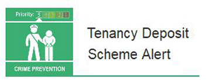

21 February 2019

Thanks to Neighbourhood Alert for sending the following Fraud Alert :Action Fraud have received several reports where fraudsters are claiming to be landlords of properties offered for rent online. Prior to a viewing the suspect requests that the individuals pay a deposit and sometimes a month's rent upfront, claiming that this money will be put into the Tenancy Deposit Scheme, and is therefore protected under government legislation.After the individual pays the money, the suspect sends a bogus email purporting to be from the Tenancy Deposit Scheme confirming they have received their deposit. However, this is not the case as the money was sent directly to an account associated with the suspect and the victim is left out of pocket and without the home they had thought to be putting a deposit on.Click on the image above to read the full alert.

Action Fraud have received several reports where fraudsters are claiming to be landlords of properties offered for rent online. Prior to a viewing the suspect requests that the individuals pay a deposit and sometimes a month's rent upfront, claiming that this money will be put into the Tenancy Deposit Scheme, and is therefore protected under government legislation.

After the individual pays the money, the suspect sends a bogus email purporting to be from the Tenancy Deposit Scheme confirming they have received their deposit. However, this is not the case as the money was sent directly to an account associated with the suspect and the victim is left out of pocket and without the home they had thought to be putting a deposit on.

Click on the image above to read the full alert.

Click on the image to

read the full alert.

