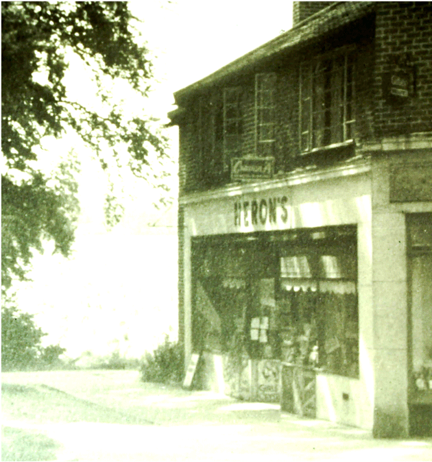
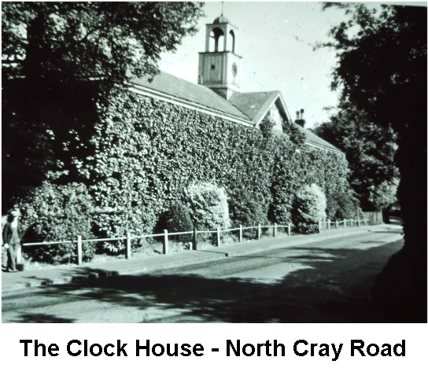
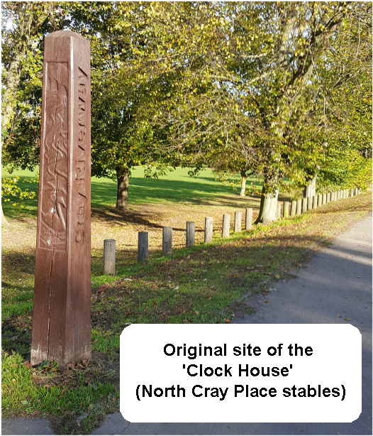

26 February 2019

HISTORY OF OUR ASSOCIATION Part 15 1959 - by Jean Gammons

In January it was announced that two-thirds of the adult population of Britain now owned a television set; and road and rail communications throughout Kent were crippled by winter fog. In February, the fighting in Cyprus ended with the signing of a peace deal between Greek and Turkish Cypriots - ending 80 years of British rule.

In June, Bexleyheath celebrated the 100th anniversary of William Morris, the designer and poet who lived at the Red House from 1859. In July the Mark 1 prototype of the hovercraft crossed from Dover to Calais on its initial passenger journey. August saw the BMC's revolutionary new mini-car go on sale in Kent. On 4 October, after one of most glorious summers of the century, temperatures at Dartford reached 82F. The same month saw the closure of two of the most famous wartime airfields: Biggin Hill and Detling. By the end of the year, parents wishing to impose a wartime discipline on their children were failing badly - when the decade began, there were no teenagers, just children and students, now there was hardly a town in Kent without a "teenage problem".

Bob Ogley

At its January meeting, the Committee noted that the Council was, at last, proposing to remove the foundations of the wartime Warden's Post from the grassed area outside Heron's shop at High Beeches and re-turf the whole of this island. It was pleased, too, that provision had been made to extend the sewage system to Honeyden and Barton Roads and the North Cray Road - although it was recognised that the Council was unable to compel residents to be connected.

It May, one of Committee reported that on a recent walk up Parsonage Lane to Chalk Wood "he had been in danger of being run down by motor cycles, trampled on by horses and shot at from air guns". There had also been further complaints about noise at night from the power-driven machinery in the garage adjoining Gattons.

At its June meeting, the Committee was informed that demolition of the former mansion at Mount Mascal, and replacing it by flats, was under consideration.

It was also concerned about the state of the "Clock House" on the North Cray Road - the condition of the building had deteriorated and was subject to much malicious damage. (This building was the former coach house and stables of North Cray Place and probably dated from the time when 'Lancelot 'Capability' Brown laid out the estate in the early 1780s).

At its next meeting, in July, the Committee was told by Cllr Macdonald that the Public Health Committee was very concerned at the number of complaints of foreign matter in foodstuffs and was asking people to take any offending article to the Public Health Department. It was agreed to mention this in the forthcoming Newsletter.

In August the Committee was informed that the Council would be demolishing the Clock House shortly; but that an application had been made to erect a filling station on its site; this had been refused and was now subject to an Appeal. Permission had been given for the building of flats at Mount Mascal. Mr Wright was still causing problems - depositing and burning rubbish, and keeping chickens, on Council land!

The AGM was held on 24 September at North Cray Place Estate. Membership had increased by 12, and the balance of funds stood at £46.5.6d. The meeting was informed that a letter had been sent to all new residents on the Bedens Field Estate, inviting them to join the Association.

By the end of the year, cattle grazing was continuing to cause problems on the Meadows; an Enforcement Notice had been served on Gattons requiring discontinuance of the unauthorised use of the garage; the sewage scheme for Barton and Honeyden Roads had been 100% accepted; and the Council had agreed to the renumbering of both sides of the North Cray Road, starting from the Bexley end.
