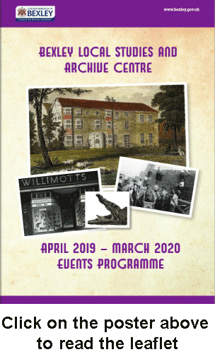

16 March 2019

Bexley Local Studies & Archive Centre 2019-2020 Events leaflet

Thanks to Jes Cooban from Bexley Archives for sending the Events Leaflet for 2019 and the following message:

Hello there

Please find attached our latest events leaflet. We are offering wide range of talks again this year - including looking at life of explorer Mary Kingsley who spent her youth in Bexleyheath, Bexley's Bubble Trouble & the Thames estuary - as well as a range of walks, 'Lunchtime Looks' and the ever popular free drop-in session with the North West Kent Family History Society.

We hope you find something of interest - and if you do remember tickets go quickly!

Please email archives@bexley.gov.uk if you have any queries.

Best wishes

Jes Cooban

Bexley Local Studies & Archive Centre

Libraries, Heritage and Archive Service

Central Library

Townley Road

Bexleyheath

Kent

DA6 7HJ

Tel: 020 3045 3369 Opening hours: Monday, Tuesday, Wednesday, Friday : 9.30 am - 5.30 pm - Thursday: 9.30 am - 7.00 pm - Saturday: 9.30 am - 5.00 pm
