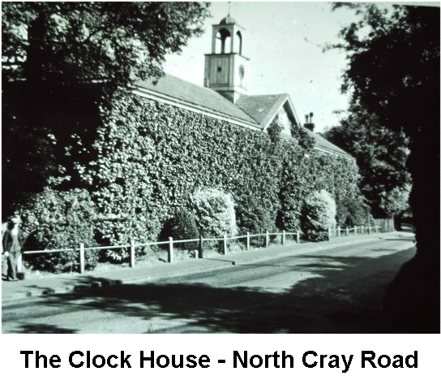

20 March 2019

HISTORY OF OUR ASSOCIATION Part 16 1960 by Jean Gammons

In February, Prime Minister Harold Macmillan said that "a wind of change is blowing through the African continent". March saw an earthquake, followed by a tidal wave, destroy the Moroccan resort of Agadir, killing at least 1,000 people; and the announcement that a barrier would be built across the Thames to protect London from tidal flooding. In May Senator John F Kennedy of Massachusetts won the Democratic nomination for the Presidential elections. September saw the advent of mechanical hop-picking, which was to see the end of the tradition of East Enders coming down to Kent for the annual hop-picking. The villagers of Swanley marched up the A20 in October to demand a by-pass, and in the same month HM The Queen launched Britain's first nuclear submarine, Dreadnaught. By the close of the year there had been an alarming outbreak of vandalism on Kent's electric trains and 178 cases of schoolboys throwing stones at passing trains; and it was announced that Conscription was to end, the last national servicemen receiving their call-up cards on 31 December - more than five million men had enlisted since the scheme began in 1939 - Bob Ogley

At its January meeting the Committee discussed the possible use of the site of the Clock House, once part of the former stables of North Cray Place - but agreed that, although suitable provision for parking cars near the river and Stable Meadow was needed, an entrance from the North Cray Road at this point would be dangerous. Other concerns raised were the problems arising from horse riding, such as damage to pavements, footpaths and public open spaces.

In February the Committee noted that Gattons Way was to be re-developed in 1960-1961, and that its existing residents would be moved to Bedens Field later in the year. A number of them wanted to return after the re-development and it was agreed that the Association should see if this would be possible. It was also agreed that the problem of the Air Raid Shelter should be raised again.

In March the Secretary was instructed to seek an assurance from the Council that, in drawing up its plans for the North Cray Place Estate, garages or garage space with suitable access would be provided within the curtilage of each house. The Committee also expressed its concern about planning proposals for two new businesses, one a fried fish shop and the other a secondhand car dealers. It was agreed that both would be detrimental to the amenities of North Cray.

April was a busy meeting for the Committee. It noted that the Council had agreed that those tenants who wished to return to Gattons Way would be given the opportunity to do so; and that it had approved the plans for the fried fish shop but that it had refused permission for access to the secondhand car dealer over the public footpath. Councillor Macdonald also informed the Committee that although work for a foul sewer on Bunkers Hill had been included in the estimates it was unlikely that this would be laid in 1961. The Committee agreed that the Council's attention should be drawn to the development of a car breakers business in the grounds of the Ruxley Shop, and noted that the 3-storey flats were being erected at Bedens Field beside the North Cray Road, although originally these had originally been planned for the far side of the site.

In May attention returned to the site of the Clock House following complaints about its condition. Horse riding on the Meadows was still a problem but the Council had agreed to erect 'No Riding' notices on certain paths and erect suitable barriers, and it was agreed that it should be asked to provide clearly defined bridle paths in the open spaces. There was good news at last about the Air Raid shelter - the Civil Defence no longer needed this as a Warden's Post and attempts were being made to get permission for its demolition from the Home Office. The sewage scheme for Maidstone, Honeyden and Barton Roads were being held up for the formal consent of certain householders - one was withholding his until the Autumn as he had now planted his garden! Council Macdonald suggested to the Committee that in view of the increased population of North Cray it might like to raise with the Council the possibility of a further councillor for the ward. It was agreed that as this required very careful consideration discussion should be deferred.

At its June meeting the Committee noted that the secondhand car business had now closed, being refused planning permission; and that the car breakers business at the Ruxley Shop was alleged to be a hobby only, and the site had now been cleared.

The AGM was held on 21 September at the North Cray Place Club. The meeting was informed that two Newsletters had been published, and that the balance of accounts stood at £43 8s 1d, reflecting a slight increase in membership. In his address, Councillor Macdonald said that he considered that caravans should be licensed and that the owners should make some contribution to the rates. He also warned of the danger of infringement on the Green Belt, adding that it might be necessary to increase the density of population in the existing built-up areas. Other business raised included the problem of bonfires and the use of guns in the Meadows.
