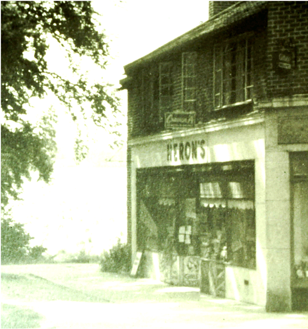
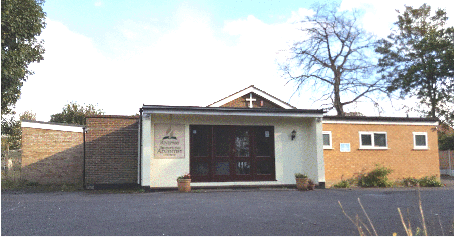
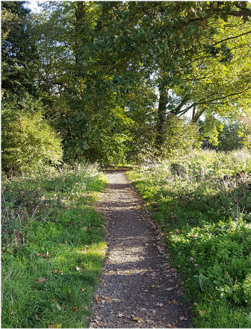
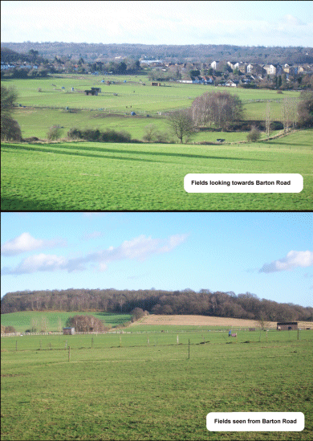

4 April 2019

HISTORY OF OUR ASSOCIATION PART 17 - 1961 by Jean Gammons

The year began with the news that an oral contraceptive pill had become available for women. In April Russian Major Yuri Gagarin became the first man to fly in space, orbiting the earth and returning safely after 98 minutes; and land at Bromley was valued at £1 million an acre. By June the price of cigarettes had increased to 1s 9d for ten. In the following month Britain applied to join the Common Market. By August a wall had been built across the western sectors of Berlin; and by the close of the year the former SS Colonel, Adolph Eichmann, had been sentenced to hang for the murder of millions of Jews during the Nazi occupation of Europe - 19 months after his capture in the Argentine. Bob Ogley.

In January the Committee noted that a revised layout for 108 houses for the North Cray Place Estate had been approved. By March it had learnt that the Council had decided not to proceed with the provision of bridle paths in the Meadows, nor with the repair of the path to Chalk Wood. However, the Committee was pleased to learn that planning permission for a petrol filling station at No. 99 North Cray Road had been refused, but noted that there was to be a public inquiry on 23 March. It also noted that the Council had agreed plans for 42 semi-detached houses in Gattons Way and 12 maisonettes; and agreed that the Association was firmly opposed to any building development whatsoever in the Green Belt. There was also serious concern about the continuing use of firearms and air guns in North Cray's open spaces, increasing the danger to wildlife and people.

At its April meeting the Committee noted that a number of youths were using firearms in the Meadows. In May it learnt that the petrol filling station's Appeal had been refused.

In August it was noted that the Council intended to grass the area outside the new shops in the Parade. In September the Committee considered asking the "Men of the Trees" association to assist in preserving as far as possible the trees on the North Cray Place Estate.

That year's AGM was held on 28 September and, for the first time, at North Cray's Church Hall. The balance of accounts stood at £53.18s.7d.

At its meeting in October the Committee noted that £600 had been included in the Council's Estimates for the provision of a riverside walk from Water Lane to Stable Meadow.

It was pleased, too, that the Council had refused planning permission for the development of the land bounded by Barton Road, North Cray Road and Maidstone Road - an important part of North Cray's Green Belt.

In November the Committee noted that the Council had confirmed the Park Department's recommendation that horse riding should be forbidden in all their major open spaces, including Chalk Wood. The Committee agreed, however, that the provision of bridle paths would be desirable, if this could be made without too much expense to the ratepayers.
