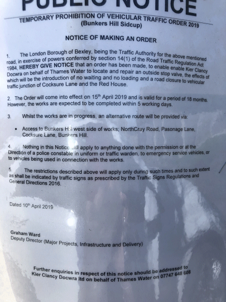

11 April 2019

A new scam

Thanks to a member for the following warning :

Thought it would be worth alerting everyone to a new scam that I, and a couple of my neighbours, had on the telephone this morning.

An automated voice which sounds remarkably like the voice that you get when calling BT says that your licence to receive telephone and broadband has expired and to avoid cut off a payment of £300 is required. It goes on to say that you will be transferred, an American voice then says that a colleague will be with you shortly to take payment. At this point I put the telephone down. Obviously the concern is for vulnerable people.

Road Closure 

Please see the attached copy of an Order to the effect that from next Monday and (hopefully) for only five days Bunkers Hill and its junction with Cocksure Lane will be closed to vehicular traffic.

This will also mean that extra vehicles will be travelling up and down Parsonage Lane so please be careful- especially if on foot.
