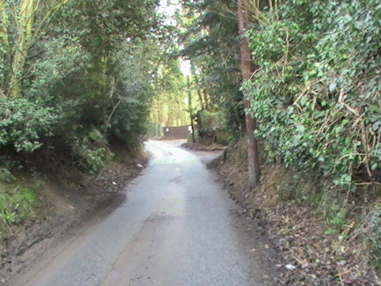
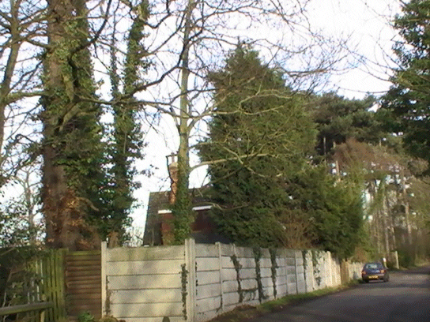
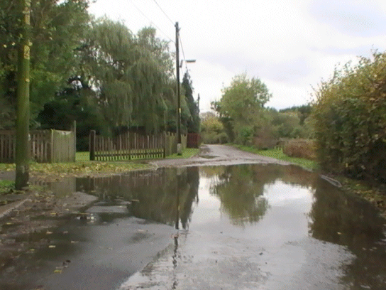
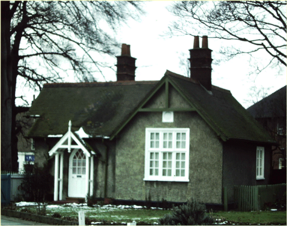

14 April 2019

HISTORY OF OUR ASSOCIATION PART 18 1962.

Researched and written by Jean Gammons

January saw the rejection by Decca of a Liverpool pop group The Beatles, whose experts said they would never make the music charts. In April a push-button "Panda" crossing was introduced in London. Immigrants from east and west poured into Kent in a bid to beat the Commonwealth Immigration Act which became law on 1st July. The following month saw the shooting dead of an 18-year-old youth from East Berlin trying to climb over the wall to the west. In November Nelson Mandela, 44-year-old African nationalist leader, was jailed for five years for incitement. In early December the Great Smog descended over South London and North Kent, a dense 'peasouper' causing traffic to move at walking pace with many cars having to be abandoned - the poisonous air blanketed most of Kent and claimed more than 40 lives. Bob Ogley

At its January meeting there was good news for the Committee regarding Parsonage Lane and Bunkers Hill. Mr Whiley of the North Cray & Sidcup Riding School had offered to contribute towards the cost of creating bridle paths. A suitable barrier was to be placed at the entrance to Gattons Way from the Lane. Provision had been made in the estimates for the current year for a new sewer for Bunkers Hill, and it was hoped that Parsonage Lane would also be provided with main drainage in 1963.

In February the Committee discussed the widening of the North Cray Road, which would require considerable capital, but the Council would be pursuing the question of priorities to be carried out. It also noted that a North Cray Community Association had been formed for Bedens Field.

The March meeting was held at the Red House, Bunkers Hill, when it was noted that the Ministry of Transport had stated that there was little hope of widening the North Cray Road in the foreseeable future, although in the Village the road was only 14' 7" wide making it impossible for two large vehicles to pass - and the Committee was worried about the extra traffic that would arise from the impending opening of the Dartford Tunnel. Concern was expressed, too, about flooding in Parsonage Lane and damage to its street lighting, the Council having refused to fit wire guards as being ineffective against heavy missiles or air gun pellets.

In April the Committee discussed the proposed Local Government Reorganisation. The Council's view was that it agreed in principal with the proposed merger with Bexley, Crayford and Erith, and that it held strongly to the view that the Urban District should be preserved as an entity in forming a Greater London Borough. The Committee agreed that it should support the Council's views.

May saw increasing concern about the flooding in Parsonage Lane from surface water, especially near Greenwood Nursery; and about the continued dumping of rubbish in Cocksure Lane. The Committee were also concerned about the unsatisfactory condition of the remaining part of the old watercress beds behind Ellenborough Road.

In June the Newsletter Sub-Committee reported that it had received a quote from a pupil of the Cray Valley Technical School: £2.50 for 1,000 copies of a printed cover, including a block designed by another pupil which would remain the property of the Association. The design was approved by the executive Committee, who also agreed that the sum of £5.5s 0d should be granted to cover the cost of printing and remuneration to the designer of the block.

In August the Committee noted that the Council had agreed to construct a 'ride' in the Meadows and to license horses to use this for £1 a year, and that The Lodge was to be connected to main drainage and a hot water system installed.

In September it noted that an inquiry was to be held into the Appeal against the Council's refusal of planning permission for two houses in Bunkers Hill. It also discussed a complaint about the smell from the maggot farm in Parsonage Lane, another about Teenagers making a noise outside the shops at High Beeches in the evening and noted that sewage works were taking place in Bunkers Hill and Cocksure Lane.

The AGM was held on 3 October at the Church Hall. The meeting was told that the Committee had continued to press for the preservation of the Green Belt and an improvement of Open Spaces. An address by T W Fagg of the Chislehurst and Sidcup Urban District Council outlined the government's proposals for the reorganisation of Local Government in Greater London, and he spoke of the opposition to the proposal to divide Chislehurst and Sidcup between two of the new boroughs. A member suggested that a bridle path be provided in Chalk Wood.

At its October meeting the Committee discussed the suggested bridle path in Chalk Wood, but agreed that this matter should be deferred until the use of the first path in the Meadows could be observed. It also discussed the continuing Nuisance of the maggot farm and noted that the Council proposed to build five pairs of houses at the bottom of High Beeches; but had refused planning permission for an additional bungalow in Parsonage Lane.

In December the year closed with reports of vandalism in the vicinity of the Church. But the minutes made no mention of the Great Smog.
