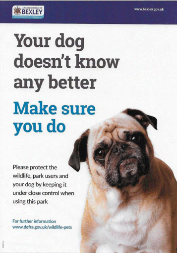

19 April 2019

News From Our Meadows Sub-Committee

Yesterday, the Meadows Team successfully persuaded Bexley's Parks Department to put up this poster near the Lake where swans are nesting to warn dog owners of the need to control their dogs in this area. Something that has been needed for a long time in order to prevent as far as is possible any more distressing incidents.

Click on the poster for an enlarged view.
