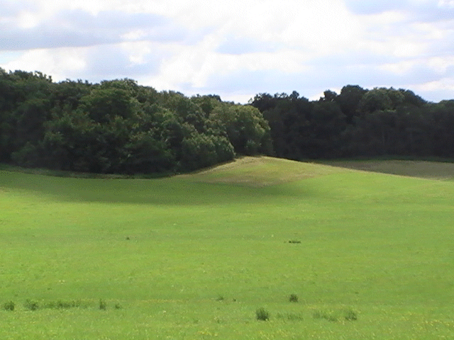
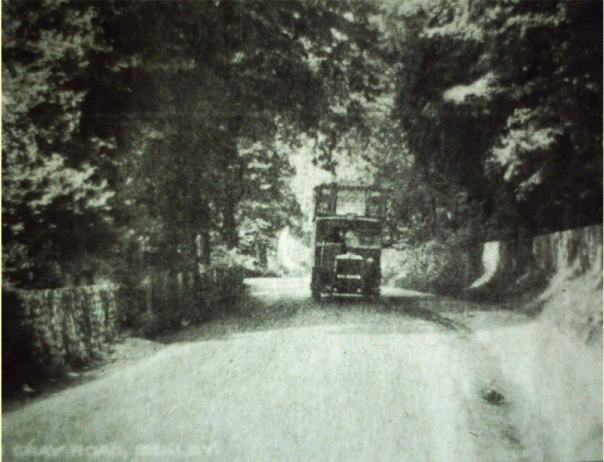

26 April 2019

HISTORY OF OUR ASSOCIATION PART 19 1963

Researched and written by Jean Gammons

In January President de Gaulle of France said that Britain neither thinks nor acts like a Continental nation and is not qualified for full membership of the European Economic Community. February saw the continuation of the Great Freeze in Kent. In March Dr Beeching's axe fell on Kent's branch railways.

In April Winston Churchill was awarded honorary US citizenship. May saw Kent author Ian Fleming's latest thriller, From Russia with Love, become a big hit with cinema goers. In June an oral contraceptive pill, made in Britain, became available on prescription.

The following month saw the Liverpool rock group The Beatles perform at Margate's Winter Gardens; although they did not top the bill.

In August 15 armed men hijacked a train and escaped with mailbags carrying more than £1 million - 'The Great Train Robbery'. September saw the opening of a new telephone exchange in Dartford - the first in the south-east London area to adopt STD (subscriber trunk dialling).

In November President Kennedy was assassinated as he drove through Dallas, Texas in an open-top car. The same month saw the completion of the Dartford Tunnel, motorists facing a toll of 2s 6d. - Bob Ogley

At its meeting in March, the Committee noted that a proposed amendment to a bye-law would allow horse riding in Chalk Wood and Mount Misery.

The main concerns at its meetings in April and July were noise and disturbance from young people at the High Beeches shops, and more firearm use and motor cyclists in the Meadows. At its meeting in September it noted that an improvement of the North Cray Road had been included in the programme for 1965-1966.

The AGM was held on 26 September in the Church Hall. The number of members attending was 40. They were told that two Newsletters had been issued; but that there was a deficiency in the accounts of £27.8s.4d, mainly due to bye-election expenses. The new Councillor, Mr Evans, outlined proposals for the new borough and the problems that had arisen from the formation of the new local authority.

At its meeting in October, the Committee expressed its concern about traffic dangers on the North Cray Road and agreed to ask the council if 30 mph limit repeater signs could be installed. It noted that the new bye-law on horse riding was imminent; but that Chalk Wood was excluded.

In November the Committee noted that the council had agreed to the construction of a bridle path in the Meadows; and the further complaints of nuisance from flies in Parsonage Lane coming from the Maggot Farm. There was concern, too, about more shot guns in the Meadows.

At its December meeting, the Committee noted that there would be new sodium lighting for the street lighting in Honeyden Road and Barton Road; but that Parsonage Lane, Cocksure Lane and Bunkers Hill would remain unlit. It noted, too, that vehicles to the new Dartford Tunnel were being routed along the North Cray Road.
