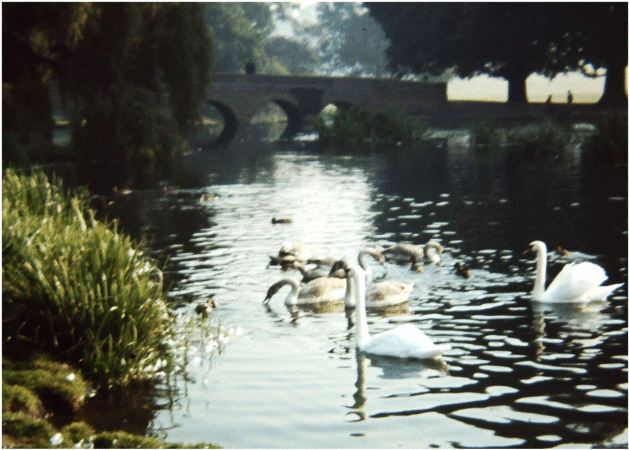

29 April 2019

HISTORY OF OUR ASSOCIATION PART 20 - 1964

Researched and written by Jean Gammons

In January British designer Mary Quant said that young girls were tired of the wearing the same things as their mothers - they preferred bold designs and very short skirts.

In February Britain and France agreed to build a Channel Tunnel.

Pop music fever hit Ramsgate in April when nearly 1,000 screaming teenagers crammed the West Cliff Hall where the Rolling Stones group were playing.

In June Nelson Mandela was sentenced to life imprisonment for plotting to overthrow the South African Government.

August saw Mods and Rockers clashing in Hastings.

In October Dr Martin King, the 35-year-old American black integration leader, was awarded the Nobel Peace Prize.

By the end of the year the death penalty for murder had been abolished and Dr Richard Beeching, chairman of British Railways, sacked.

Bob Ogley

At its January meeting the Committee noted that the lighting in Parsonage Lane was so poor that several lady members were unwilling to go out at night unaccompanied. Also that planning permission had been given for a house in the ancient Gattons Wood, Cocksure Lane, which lay in the Green Belt.

At its May meeting the Committee noted the outcome of the meeting with the Chief Planning Officer, which was that there had been strong support from the Ministry of Agriculture for the land forming Gattons Wood to be used for farming and forestry. The Officer had also promised to advise the Association if the plans were to be for a "luxury" dwelling. Unguarded holes had been dug in Parsonage Lane for the new sewer and the Committee agreed that reinstatement of the damaged grass verges was needed. The Committee also expressed its concern about the planning application being considered by Dartford Council for a permanent caravan site on land adjoining Mount Misery, with access via Parsonage Lane. And about the continuing nuisance of flies from the maggot farm. But it welcomed the news that Miss Betty Rhodes had been elected as a Borough councillor for North Cray.

See [NewsMail 2/9/2017](http://www.northcrayresidents.org.uk/newsmail_files/nm0292.html)

Betty Rhodes attended the August meeting and promised her help in getting outstanding problems resolved - including the lack of maintenance and supervision in the Meadows. She also reported that the Labour Group were suggesting that the existing North Cray Road should merely be straightened. Blue bottles were a continuing problem and the Committee noted that the owner of the Maggot Farm had been fined for leaving decaying carcasses unenclosed.

In September, the Committee noted with concern that in the Meadows youths with guns were threatening the cygnets. And that the conduct of three lads - known as the 'Dirty Lads' of North Cray - were causing a nuisance in The Grove. It also agreed that the Secretary should look into a proposed building development in the grounds of Janina House [139 North Cray Road].

The AGM was held in the Church Hall on 24 September. 35 members attended. The meeting was told that there had been two editions of the Newsletter and that there was a deficit of £5.18.7d in the accounts due to the increased cost of printing and stationery. A proposal was made from the floor that the annual subscription should be increased to 2/6d [12.5p]. Being the last AGM before the formation of the new London Borough of Bexley, the Association recorded its thanks to the councillors and staff of the Chislehurst and Sidcup Urban District Council.

At its October meeting, the Committee noted that there were no proposals for any building development at Janina House and that a Public Inquiry was to be held into the refusal of planning permission for a petrol filling station at 153-157 North Cray Road. Concern was expressed about further complaints of guns and horse riding in the Meadows, and that bridle paths had not yet been provided; and about the number of cars dumped near the dene-hole in Chalk Wood. A proposal was made to hold a Dance and Social Evening.

The year closed with concern being expressed at its December meeting that the North Cray Road was becoming a primary route for the Dartford Runnel; that planning permission had been given for the use of part of Orchard View Farm in Parsonage Lane for the breeding and boarding of dogs and that there was an Appeal against the council's refusal of planning permission for a bungalow - and that there was continuing vandalism at Five Arch Bridge.
