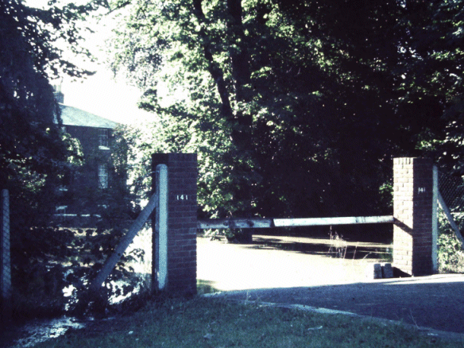

10 May 2019

HISTORY OF OUR ASSOCIATION Part 21 -1965

Researched and written by Jean Gammons

January saw the death of Sir Winston Churchill, followed by a three-day Lying-in-State in Westminster Hall. In February cigarette advertising was banned from television. April saw the coming into being of the Greater London Council - which took in Kentish towns such as Bromley, Beckenham and Bexley but left these as part of Kent. In May HM The Queen dedicated an acre of wood and grassland in memory of President Kennedy, close to the spot where the Magna Carta was signed at Runnymede. June saw two people return their OBEs in protest at the award of MBEs to The Beatles; and the announcement of a legal blood alcohol limit for motorists. In another threat to world peace, India and Pakistan declared war in September over rival claims on the border state of Kashmir; and Coronation Street remained Britain's most popular TV series. In October Ian Brady and Myra Hindley were charged with the murder of 10-year-old Lesley Ann Downey, whose body had been found on Saddlesworth Moor. In November abolition of the death penalty and the Race Relations Bill both became law; and the Prime Minister of Rhodesia, Ian Smith, issued a Unilateral Declaration of Independence. Bob Ogley

At its January meeting, the Committee formed a Social sub-committee to investigate the possibility of holding a social function for the Association. It also noted that vandal-proof lamp guards were to be provided in Parsonage Lane; and that an Inquiry was to be held into the proposed bungalow at Orchard View Farm.

In February it noted that plans for the New North Cray Road were now available.

In March it noted that the North Cray Road had become flooded outside Cray Hall.

In July it was concerned at the dangerous driving of motor cycles in the Meadows.

The AGM was held in the Church Hall on 30 September. 25 members attended. The accounts now showed a surplus of £15.19.6d as a result of an increase in members and abnormally low expenses. It was agreed that the incoming Committee should consider an increase of the subscription to 2/6d [12.5p] per member, with the exception of Old Age Pensioners whose subscription could be 6d [2.5p]. The meeting expressed concern about the smell coming from Orchard View Farm's maggot farm in Parsonage Lane.

At its meeting in October, the Committee agreed that the aim should be to publish three Newsletters a year. It expressed its concern about the smell and vehicle-breaking at Orchard View Farm, and agreed that this should be reported to the council. It noted that planning permission for a petrol filling station on the site of the Old Rectory [in what is now Leafield Lane] had been refused.

In November, the Committee noted that the owner of Orchard View Farm had agreed to cease vehicle breaking and metal bending; but that permission had been given for the boarding of dogs.
