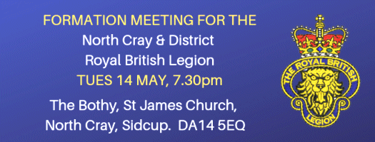

12 May 2019

THE BIG ONE! Joining together to form the North Cray & District Royal British Legion Branch!.

Dear North Cray Residents

Please join us on Tuesday 14 May at The Bothy, St. James Church from 7.30pm for the BIG ONE! A meeting which we hope will pass a resolution to create the new North Cray & District Branch of The Royal British Legion.

David Jones 'DJ' has put himself forward as Branch Chair; Bob Chapman is Standard Bearer, but has agreed to be Vice Chair if there are no other takers; Nicola Coppen 'Otter' has agreed to be Secretary (inc. Membership) if there are no other takers

Having these 3 roles filled is good but we still need a Treasurer and at least 4 Executive Members who can ensure the Officers are kept in line!

Click on the poster for an enlarged view

We are pleased to confirm that John Harrington is honoured to be asked to be the Branch President of the new Branch, in turn we are honoured to have John agree to this role. In addition we need general members - EVERYONE can be involved in shaping the Branch, but we appreciate some people may want to be more or less active than others, but all are welcome. To find out more, or register interest, please feel free to contact the Team at:[NorthCrayDistrictRBL@outlook.com](mailto:NorthCrayDistrictRBL@outlook.com)

We look forward to seeing you on Tuesday at 7.30pm at The Bothy, where you will be invited to complete membership forms as part of the formation of the new Branch. Thank you in advance. DJ, Bob & Nic
