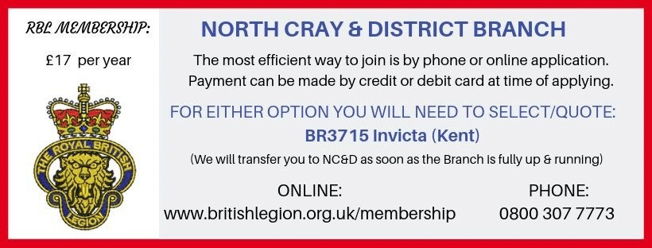

17 May 2019

How to join The Royal British Legion, North Cray & District Branch!

Dear NCRA Members

On behalf of DJ, Bob Chapman & myself, plus the other newly elected Officers and Committee, we would like to offer our sincere thanks for your support in bringing a new Branch of The Royal British Legion to the area.

We are thrilled to confirm that the Resolution was Passed on 14 May 2019 and County have subsequently approved the formation of the North Cray & District Branch of The Royal British Legion, so our paperwork has now been submitted to Head Office for their Approval. As the Branch set up is in progress, we can confirm how you can join the new Branch:

The most efficient way to join is to go Online (www.britishlegion.org.uk/Membership) with your email address & phone number to hand or phone (0800 307 7773).

Either way, have your payment method ready. After providing your membership details, you need to advise the agent, or select the Branch to join, this is:

Invicta Branch

(the search field invites you to add 3 or more letters to find the branch)

One you have finalised your membership, we will ensure you are transferred across to the North Cray & District Branch via the Membership Secretary at the Invicta Branch.

Feel free to refer to the graphic!

Many thanks once again for being a part of HIstory for the area in bringing about a new Branch of The Royal British Legion to benefit our Community.

Kindest regards

Nicola 'Otter' Coppen
