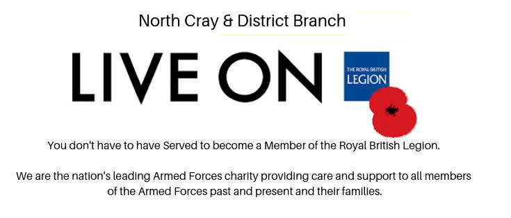

24 May 2019

D Day Commemoration.

There will be a service at 6pm on Thursday 6th June St James Church to commemorate the D Day Normandy Landings.

The service will include a reflection and prayers for peace.

Click on the poster for an enlarged view

If any one would like to do a reading (scripture or poem) please contact Andrew Hill, Bexley Team Ministry on 07982129624.
