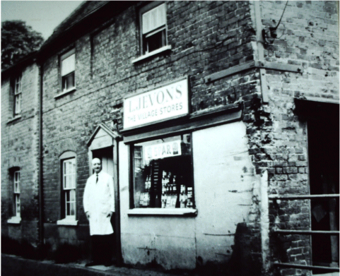
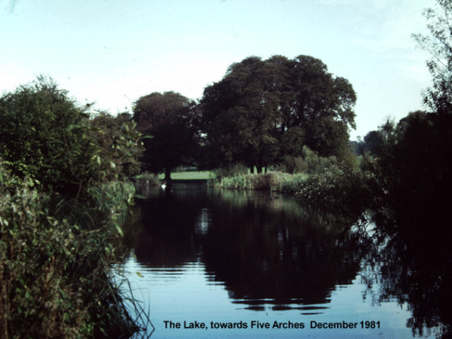

29 May 2019

HISTORY OF OUR ASSOCIATION Part 22 1966

Researched and written by Jean Gammons

In February, Freddie Laker formed an all-jet airline company, to cater for the booming package holiday trade; and the world's first public hovercraft service opened at Pegwell Bay taking passengers to Calais. In June a gas flow of up to 17 million cubic feet a day was found in the North Sea; and Kentish wine, so popular during the Roman occupation, was about to become available again. By the end of the month Swanley bypass, part of the new A20, had been opened. In July the government imposed a six-month standstill on wages, prices and dividends, to be followed by six months of severe restraint. In October the Post Office announced the introduction of postcodes to all homes; and 166 children and 28 adults were killed at a school in Aberfan by an avalanche of black slag. Mini dresses were being worn by girls everywhere, outraging moral watch dogs who deplored the "new permissive society". Bob Ogley

When the Committee met in January, it was told by the Secretary that there had been 35 accidents in the North Cray Road during the last nine months of 1965, with people injured. Cllr Betty Rhodes promised to ask the council if it would approach Mr Jevons with a view to purchasing his shop so that it could be demolished, this enabling at least some vehicles to safely leave the road at this point in an emergency. The Committee also noted that two planning applications to build in the Green Belt had been rejected by the council; but that horse riding in the Meadows was not being confined to bridlepaths.

At its March meeting, the Committee heard further bad news: there was continuing to be no control over horse riders in the Meadows, with two incidents of riderless horses running into cars on the North Cray Road. There was shooting on Mount Misery and more rubbish dumping, especially in Cocksure Lane. The good news was that the North Cray Road Widening Scheme had been brought forward to 1967/1968.

At its April meeting, the Committee learnt that an Enforcement Order was to be served on Mr Sowak of Orchard View Farm in respect of car breaking and storage, and the bending of metal bars. He was also to be asked the precise area to be used for the breeding of maggots. It noted that no members wished to attend the planned trip to the New Theatre, Bromley, on 3 June to see "Early one morning" (later, at its June meeting, it noted that the theatre trip had been a great success).

In July the Committee learnt that there had been another fatal accident on the North Cray Road.

At its August meeting the Committee noted that the council had received a proposal for the use of 26 acres of Footscray Meadows by the Camping Club of Great Britain as a camping and caravan site. 100 members had attended the special meeting, at which there had been an overwhelming opposition to the scheme. There had been further complaints from members in Parsonage Lane about the offensive stench permeating from Orchard View Farm; and there had been a number of local burglaries.

The AGM was held at the Church Hall on 20 September. Members were told of the difficulties the Committee were facing in establishing with the new Bexley Council the happy relationship that had existed between the Association and the former Chislehurst and Sidcup Urban District Council. They were also given the good news that the plans for the improvement of the North Cray Road had now been approved by the Ministry of Transport; and that the Association was continuing its careful watch on a possible building development in the Green Belt. The balance of accounts stood at £12.10.5d.

At its October meeting the Committee considered proposals for another visit to the theatre in Bromley in December, followed by a supper; and for a cheese and wine party in the New Year. And noted that there were pot holes in Parsonage Lane.

In November, it learnt that the Town Planning Committee had rejected the plan for a camping and caravan site in the Meadows. Also, that the Parks Committee had reversed its previous decision not to dredge the lake for canoeing, and instructed the Secretary to find out the reason for this change. The Committee also discussed the desirability of a meeting with the council about the Association's proposals for the future of the Meadows - and that attempts be made to bring on board representatives of local Conservative and Labour committees, the Footscray Association and Royal Park residents to agree a common policy.

The Committee also noted that 72 members had booked for the theatre trip, and agreed that there should be cheese and wine party in early April 1967, with a sub-committee to plan it. It also agreed that the Postmaster General should be asked for the postal address of Sidcup to continue to include the designation Kent.

Noting that residents in The Grove and The Spinney had stated that they were prepared to make a contribution to the provision of a number of varieties of trees in their roads, the Committee instructed the Secretary to approach the council on this.
