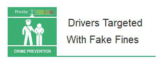

3 July 2019

Thanks to Neighbourhood Alert for sending the following Fraud Alert :

Click on the image to

read the full alert.

Action Fraud have received an increase in reports and intelligence where elderly victims are being targeted by individuals purporting to be police officers or traffic wardens.

The victims are being approached whilst parked in a car park and are told by the suspect that they have parked illegally or broken a speed limit and a photo has been taken of their car for 'evidence'.
