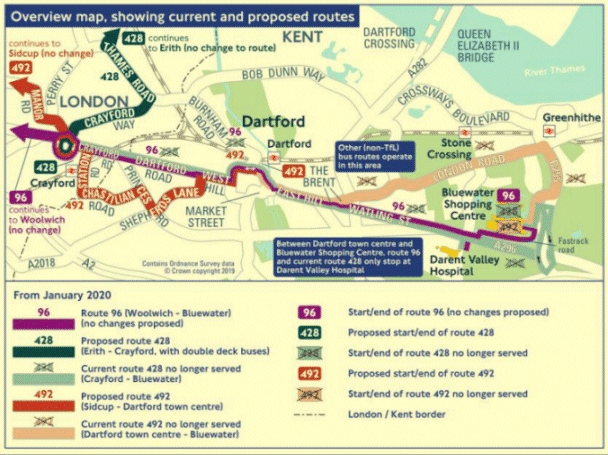

01 August 2019

Proposed changes to the 492 bus service.

TFL have proposed the following changes to the 492 bus service.

Click on the poster for an enlarged view

This will mean the 492 will no longer run between Dartford and Bluewater.

The consultation period closes on the 10 September 2019.

Please select this [LINK](https://consultations.tfl.gov.uk/buses/96-428-492/?fbclid=IwAR2wHifVdTnjy5LAhRxWrjPqM65Dce4of-_iDwLI9h0uuoy4P6qb6FyH8WM) to visit TFL website for full information.

TFL would like to hear your comments by :

. email at consultations@tfl.gov.uk

. write to FREEPOST TFL CONSULTATIONS

. call on 0343 222 1155
