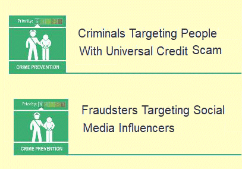

06 August 2019

Fraud Alerts

Thanks to Neighbourhood Alert for sending the following Fraud Alert :

(1) Action Fraud has received 63 reports about a scam in which fraudsters target people with offers of 'low cost' loans or 'free' government grants. What the victims aren't told is that the money they'll receive is actually an advance payment for Universal Credit. The criminals use the personal information they've obtain under false pretences to make an application in the victim's name. After the fraudsters have taken their 'fee' from the advance payment, the victim is then left to pay back the total amount once their repayments begin.

Click on the image to

read the full alert.

(2) Fraudsters Targeting Social Media Influencers

Be Aware

The National Fraud Intelligence Bureau has received intelligence to suggest that fraudsters are contacting social media influencers, based in the UK and abroad, offering them the opportunity to market a bogus product, service or investment opportunity.

Fraudsters will present professional and credible pitches to the social media influencers and try to convince them to feature the opportunity for a fee on their social media profiles in order to entice unsuspecting followers of the influencer to sign up or make a purchase.
