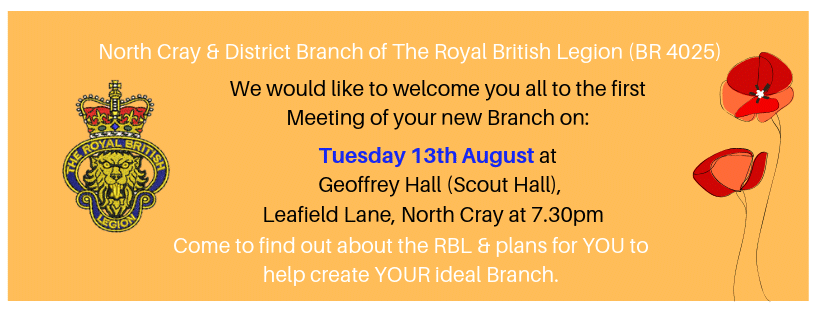

07 August 2019

New RBL Branch is up & Running!

Thanks to Nicola Coppen, Branch Secretary of the North Cray and District Royal British Legion for this message :

Hello Everyone!

It gives us great pleasure to advise that the North Cray & District Branch of The Royal British Legion is up and running!

Those who have registered interest in becoming members will soon receive details of how to become a member & we invite everyone to join us at the first Branch Meeting - details on the attached graphic.

We would be grateful if you can share with others - whether on Facebook, Twitter or other Associations. We incorporate North Cray, Joydens Wood, Wilmington, Dartford and part of Bexley.

Huge thanks to 1st North Cray Scout Group for their support (and starting this idea!) and to the Committee Officers and Executive Members who have volunteered in these essential roles.

This is a Branch for you - so please come along on the 13th August and meet us with your ideas!

We all look forward to meeting you.

Nicola

Branch Secretary

North Cray & District Branch of The Royal British Legion

c/o 1st North Cray Scout Group

The Geoffrey Hall

Leafield Lane

Off North Cray Road

Bexley. DA14 5EB

NorthCrayDistrictRBL@outlook.com

---
