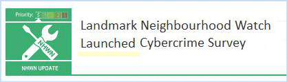

07 August 2019

Thanks to Neighbourhood Alert for sending the following message :

Click on the image to

read the full alert.

Help us understand the impact of cybercrime and be in with a chance to win £50 worth of M&S vouchers

Neighbourhood Watch has today launched a landmark new survey to understand the impact of cybercrime on communities across England and Wales.

Traditionally Neighbourhood Watch has been focused on keeping people safe in the places they live but with the advent of new technology, it's clear people can be at their most vulnerable when they occupy online spaces.

Action Fraud, the national fraud and cybercrime reporting centre run by the City of London Police, revealed that last year cybercrime victims lost £28m to online criminals. It reports more than 12,000 cases of cybercrime every six months.

With the threat from online criminals only ever increasing, it is essential we understand the impact this type of crime has on members as well as their understanding and perception of cybercrime.

The survey, designed in conjunction with cybersecurity company Avast, takes just 10 minutes to complete and one lucky responder will be in with a chance to win £50 worth of Marks and Spencer vouchers.
