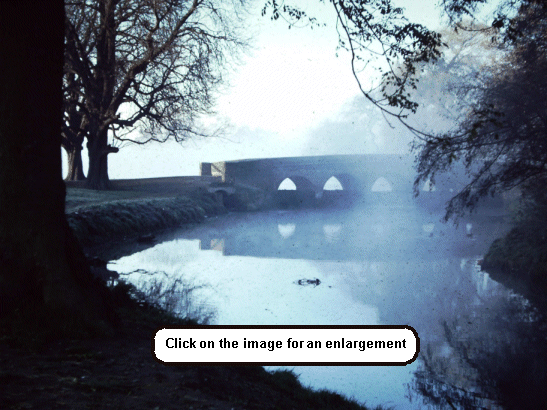
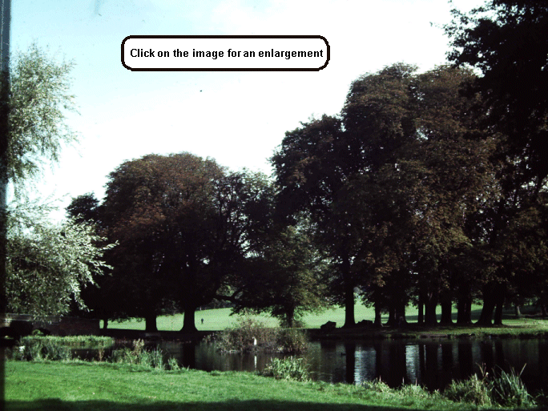
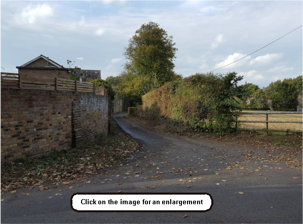

28 August 2019

HISTORY OF OUR ASSOCIATION Part 23 1967

In January Donald Campbell died when his jet-powered Bluebird somersaulted into Coniston Water whilst attempting to break his own water speed record. March saw nine executives of the German company that launched the drug known as thalidomide charged with causing death by negligence and contravening drug laws. and the oil tanker, The Torrey Canyon, run aground off Lands End spilling her cargo and fouling Cornish beaches. In May Sandie Shaw, the barefooted British singer, won the Eurovision Song Contest. June saw the end of the six-day war between Israel and the Arab states, and in July ITV launched a regular daily news programme called News at Ten. Kent's first comprehensive school opened at Swanley in July. In November the pound was devalued in the worst financial crisis for 20 years and there was a rail tragedy at Hither Green, killing 49 and injuring 78. In December the year closed with a team of 30 Cape Town doctors led by Professor Christian Barnard giving a new heart to a man suffering from heart failure; England and France celebrated a triumph of international co-operation by introducing Concorde, the world's first supersonic airliner and the Lawn Tennis Association ended the distinction between amateurs and professionals.

Bob Ogley

At its meeting in January the Committee noted that a meeting had been held with a number of local organisations on 15 December about the future of Footscray Meadows and appointed a sub-committee to plan a Cheese and Wine Party for the 29 March.

In February the Committee discussed another public meeting about the Meadows to be held on 27 February at the North Cray Primary School. And agreed that the charge for the Cheese and Wine Party should be 3/6d a head, with a licensed bar.

At its March meeting, the Committee was informed that grazing on the Meadows was to cease.

In April, the Committee noted that the Party had been a success, although there had been a loss of £3.14.10d. It also expressed concern about the extent of building taking place at Orchard View Farm in Parsonage Lane.

At its meeting in July the Committee noted that a letter had been received from the council saying that the intention was to leave the Meadows in a natural state; but expressed their concern about the council's plans to dredge the Lake to provide canoeing facilities.

It also noted that a number of trees protected by a Tree Preservation Order (TPO), on land north of Bunkers Hill, had been felled.

In August it learnt that a Mr Ragott of No. 11 Palm Avenue had admitted that he was responsible for dumping rubbish in Cocksure Lane. Also that there was to be a Public Inquiry into an appeal against the refusal of planning permission for a petrol filling station at No. 99 North Cray Road (Water Lane).

The AGM was held in the Church Hall on 25 September. Some 40 members attended. The meeting was told of the council's agreement to leave the Meadows in a natural state, except that they planned to dredge the Lake for canoeing. Also, about the Association's concern about the dumping of rubbish at the roadside and in Open Spaces; the loss of trees both in the Meadows and elsewhere, even TPO protected ones; and the Nuisance being caused by the Maggot Farm in Parsonage Lane. Expenditure had exceeded income by £6.8.1d due to the cost of printing and stationery; and a number of subscriptions had still to be collected. The meeting agreed that an alternative cover for the Newsletter should be considered, to save expense. Mr Wollweber resigned as Secretary and Mr A Camp was appointed in his place. After discussion, the meeting agreed that the Association should adopt a more militant attitude in its approach to the council and expressed its concern over dredging the Lake and the possible destruction of the Willow trees.

At its meeting in October, the Committee re-elected Mr Wollweber as Vice Chairman and agreed that Chairman Nash should meet with Committee members in January to draw up a Membership List, allocate Collectors and investigate a method of keeping Membership records. It also agreed that the cover of the Newsletter should not be changed.

In November the Committee noted that the proposed petrol station in Water Lane had been refused by the Inquiry; and that a large cow shed was being built by Mr Kimber in Parsonage Lane.
