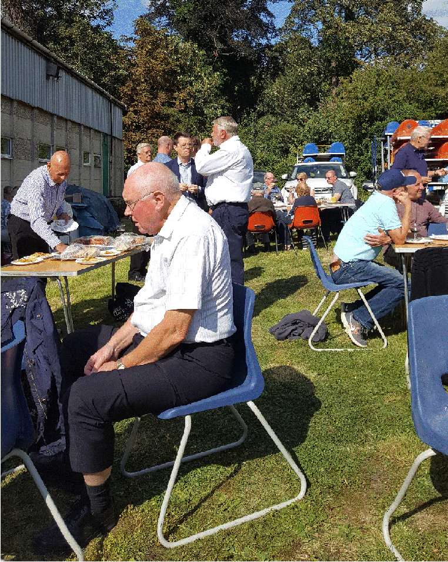

8 September 2019

The NCRA's 75th Anniversary.

On Sunday afternoon, 8th September, the NCRA marked its 75th year with a social gathering of over 70 members in the grounds of the scout hall of the 1st North Cray Scouts in Leafield Lane. This first social event of the Association for many years was organised by committee member David Jones, known to everyone as DJ.

At the event, DJ paid tribute to the many people who had served our community in the past. People like former chairmen Philip Nash and Colin Wolweber, and our previous councillors: Betty Rhodes and Don Massey. And the parents of John Harrington, our present President, who like John himself, spared no effort in trying to make North Cray a better place in which to live and raise families.

DJ said, too, that the NCRA is also indebted to those who serve us today. People like our MP, James Brokenshire, who has never failed to support us in our efforts to protect North Cray's precious Green Belt. And our local councillors, Alan Downing and Alex Sawyer, who support us in so many ways throughout the year. DJ also paid tribute to Ann and Michael Kelsey who have been unfailing in their support of the NCRA for very many years. Our thanks were also due to Bob Chapman and Nicola Coppen of the 1st North Cray Scouts, who had made it possible for us to meet here today. And of course our members! Without their support there is very little that the NCRA would be able to do.

In closing, DJ mentioned the invaluable work being done by the NCRA's various sub-committees : the Meadows Action Group formed to try to resolve the many problems faced by users of Footscray Meadows, eg illegal fishing and harm to wildlife, aggressive dogs, quod bikes and litter. Other groups are focusing on the unauthorised activities taking place on Stuarts land at 57 North Cray Road and at Woollett Hall Farm, Water Lane, better known as Kelseys. Yet another is trying to stop a housing development on garden land between St James Way and The Grove, and the threat to the well-being of a 200 year old Cedar tree planted by 'Capability Brown'. DJ added that more sub-committees are currently being planned, one to try to get Defribrillators provided in strategic points in North Cray and another to seek improvements in Highway safety on the North Cray Road following the recent fatal accident.
