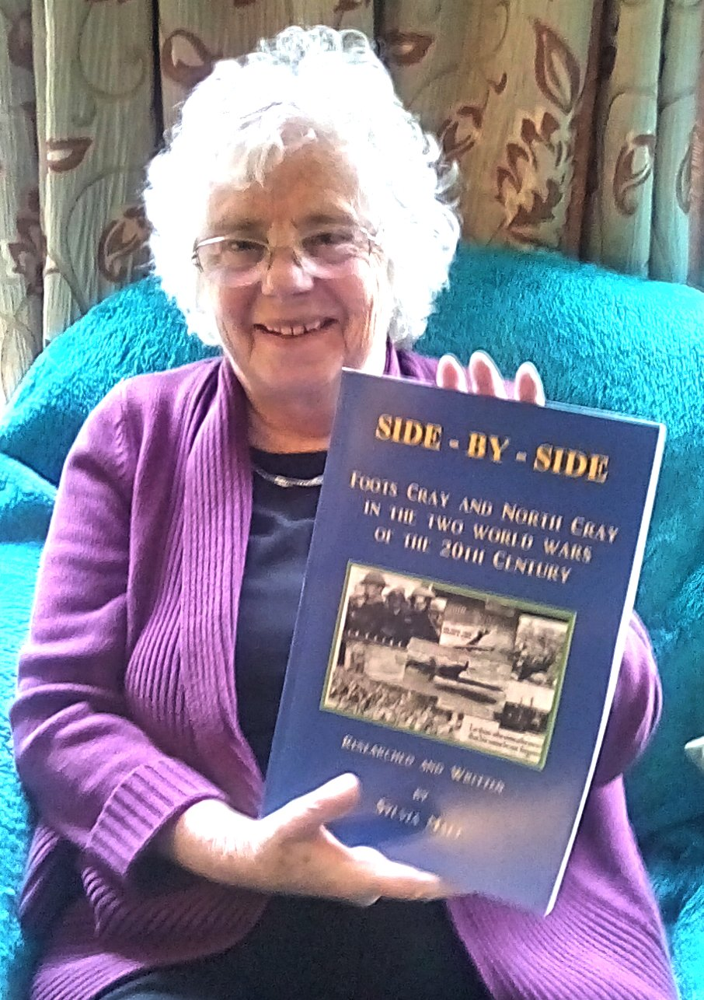
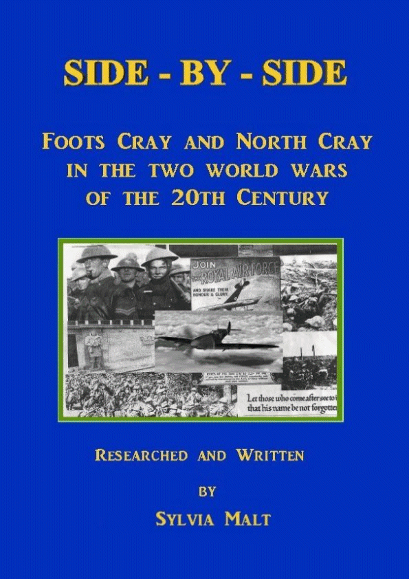

May 2018

Side-by-Side - Now In Print

Side-by-Side, is a unique history of Foots Cray and North Cray in the two world wars of the 20th century.

Researched and written by local historian Sylvia Malt, it gives detailed accounts of the men and women who served and fell in these terrible conflicts.

The book is illustrated throughout with many maps, newspaper cuttings and photographs.

Following its publication as e-book on the NCRA Web-Site earlier this year, we received a number of requests to sell a printed version. NCRA is pleased to announce that a 120 page A4 limited edition of this fascinating book is now available for purchase.

The normal price will be £10.00 including delivery but it is available to NCRA members residing in North Cray at an introductory discounted price of £8.00 including local delivery.

This is a strictly limited edition and so to avoid disappointment please place your order by selecting cover image above.
