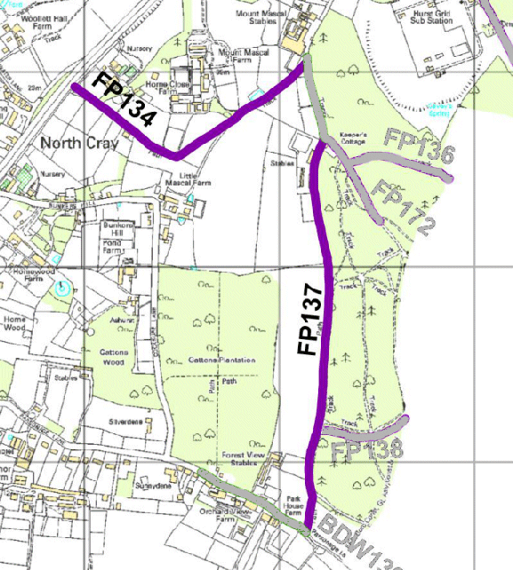

27 July 2017

NORTH CRAY'S PUBLIC FOOTPATHS

If you are reading this, it is very likely that one of the reasons why you joined our Association is because you support one of its key Objectives - protection of the Green Belt.

Access to the Green Belt is important, too, and we in North Cray are fortunate in not only having a long stretch of Bexley's Green Belt so close at hand, but in being able to enjoy easy access to it by means of several public footpaths - ones that also lead to the neighbouring woodlands of Joydens Wood and Chalk Wood.

Bexley Council are committed to maintaining these precious and ancient Rights of Way and to this end have produced an inspiring Improvement Plan, under which it undertakes to inspect its network of paths twice a year and remedy any problems found.

The [Improvement Plan](https://www.bexley.gov.uk/sites/bexley-cms/files/Definitive-statement.pdf) focuses on North Cray in several places and is well worth reading.

The task faced by Bexley's Rights of Way (RoW) team is a huge one, however, as it has hundreds of paths and bridleways in its care throughout the borough. Our members could help in this task by regularly walking these paths (perhaps with secateurs!) and reporting any problems they encounter to The Committee, so that we can quickly bring them to the attention of the RoW and have any blocked path made accessible again.

Two of the footpaths we have in mind are FP 134 (leading up from the North Cray Road and then joining a bridleway at Mount Mascall Stables leading to Vicarage Road) and FP 137 (beginning in Parsonage Lane and then linking with FP 134 along the same bridlepath to Vicarage Road). Taken together, these two paths can form a circular route leading back to North Cray.

FP 137 also leads to other paths into Joydens Wood.

See Map :

Click on the map for an enlarged view

Despite the RoW's efforts, one of our paths (FP 137) has been illegally closed off twice in the past year! But regular monitoring by local people walking these paths is key to preventing this from happening.

Please help to keep these ancient paths open and accessible - not only for us but for our children and grandchildren in the decades to come.
